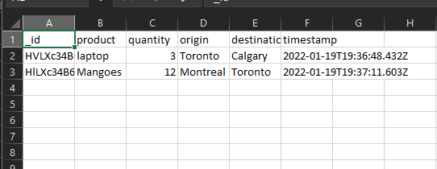
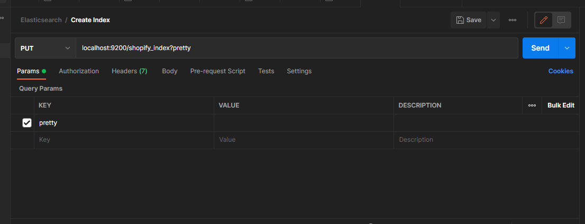

# CRUD App - Shopify Backend Challenge

## Overview
This is a CRUD app created for the Shopify Backend challenge.

Users can:
1. Add/Create products to the inventory
2. View/Read products present in the inventory
3. Modify/Update products present in the inventory
4. Remove/Delete products from the inventory
5. The user can also export inventory data as a csv.

## Tech Stack
This app uses Express JS (built on top of the node js) and Elasticsearch.  
 ** The view engine used for rendering views is **ejs** and a bit of client code (mainly javascript) used for exporting data to a csv. The database client is an abstraction built on top of the elasticsearch client to enable granular control over the database. 

## Demo Video

https://user-images.githubusercontent.com/39810925/150198655-5d5ae7b8-d360-4e4f-8490-6f34bd43fc5c.mov

 Video

## Sample CSV File 



## Routing
GET http://localhost:4000/

    Navigtes to Homepage
    This invokes the get request handler of the logistics 
    controller which fetches all of the products from the inventory.

GET http://localhost:4000/logistics/create

    Navigates to a form page for adding a product to the inventory.
    On clicking add, the form body includes the following:
    - Product Name
    - Quantity of the Product
    - Origin - Where is the product coming from
    - Destination - Where will the product go
    The request will be handled by the logistics controller
    which will save it (via POST logistics/save request) 
    using the database client to store the incoming data. On 
    a successful save, the user will be redirected to the home page.

GET http://localhost:4000/logistics/:_id

    GET request that renders a web page with a form and pre-filled 
    values for the product. On clicking modify,
    a PUT request is made via logistics/update including the 
    form body containing the product details to be modified 
    and saved. If the save is successful, the user will be redirected to the home page.

POST http://localhost:4000/logistics/save

    A POST request to save the product details. On a 
    successful save, user is redirected to the home page.

PUT http://localhost:4000/logistics/update

    A PUT request to update the product details

DELETE http://localhost:4000/logistics/:_id

    A DELETE request to delete the product from the database.

EXPORT CSV Overview

    For exporting the data, the data is already present in 
    the view and when the user clicks the export button, 
    using javascript on the client side, a csv file is generated.


## Project Setup

**Please make sure node, npm, postman and docker are installed before continuing**.

1. Clone the repository via

```bash
git clone 
```

2. Open up a terminal/CLI and type/paste  

```bash
docker pull docker.elastic.co/elasticsearch/elasticsearch:7.16.3
```
This pulls the docker image from which we will create a container for elasticsearch.

3. Then type/paste

```bash
docker run -p 127.0.0.1:9200:9200 --name es-container -e "discovery.type=single-node" docker.elastic.co/elasticsearch/elasticsearch:7.16.3
```

4. Open up postman and make a put request (link - localhost:9200/shopify_index?pretty)  as shown



5. Open another terminal window or tab and then navigate to the cloned folder, once inside type/paste the following:

```bash
npm install
```

6. Finally type/paste the following:

```bash
npm start
```

The server should be running now on 

**http://localhost:4000**

## Possible Improvements

- Include pagination for cycling through the data as if the app scales, database queries will become more expensive.
- Pagination will help in exporting data to a csv file as well.
- The current API supports a remote procedural call structure. This can be transformed to a REST API which has its own strict specifications making it easier to consume by a client.
- Once, in production, the code will need to modified to follow best practices. For example using express based middleware such as gzip to reduce the response body for reducing latency.
- Possibly, using a throttler mechanism in case of DDOS attacks.
- Using https to incorporate encryption.
- Tests can also be included ranging from unit, functional and e2e integration tests.
- A seperated Frontend for the client for better management of the application.
- Add error handling on both the frontend and backends.
- Containerize the entire application using docker or other tech to run it independant of any machine, making it easier for the developer.
- Add documentation on how to set up and on how the app works. This will be very useful as the codebase grows.
- Hide important environment variables in case the repository is public.

**Note: This is not an exhaustive list.


